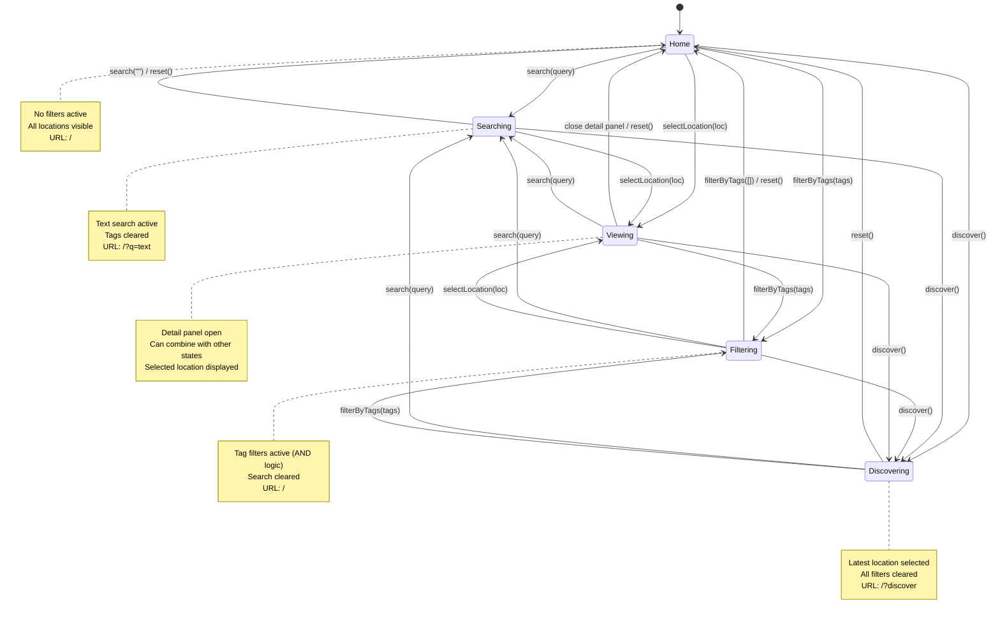

# Travel Map State Machine

## Overview

The application uses a centralized state management system with clear state machine semantics. All state lives in `src/lib/stores/appState.js` using Svelte stores.

## Core State Variables

The application manages the following state variables in `src/lib/stores/appState.js`:

- `allLocations` - All location data loaded from content
- `searchQuery` - Current search text (empty when not searching)
- `selectedTags` - Set of active tag filters (empty when not filtering)
- `selectedLocation` - Currently selected location (null when not viewing)
- `mapBounds` - Current map viewport bounds (for filtering visible locations)
- `discoverMode` - Boolean flag for discover state
- **`isPreviewingLocation`** - Temporary flag during hover preview (prevents list reordering)

## States

### 1. **Home** (Default)
- **Characteristics**: No filters, no selection, all locations visible
- **State Values**:
  - `searchQuery = ''`
  - `selectedTags = Set()`
  - `selectedLocation = null`
  - `URL = '/'`

### 2. **Searching**
- **Characteristics**: Text search active, filtered results
- **State Values**:
  - `searchQuery = 'some text'`
  - `selectedTags = Set()` (cleared)
  - `selectedLocation = null` (optional)
  - `URL = '/?q=some+text'`

### 3. **Filtering**
- **Characteristics**: Tag filters active (AND logic), filtered results
- **State Values**:
  - `searchQuery = ''` (cleared)
  - `selectedTags = Set('tag1', 'tag2')` (must have ALL tags)
  - `selectedLocation = null` (cleared when filter changes)
  - `URL = '/'` (tags not in URL)

### 4. **Viewing**
- **Characteristics**: Location selected, detail panel open
- **State Values**:
  - `selectedLocation = location object`
  - Can be combined with Searching or Filtering states
  - Detail panel shows on right side

### 5. **Discovering**
- **Characteristics**: Latest location featured
- **State Values**:
  - `searchQuery = ''`
  - `selectedTags = Set()`
  - `selectedLocation = most recent location`
  - `URL = '/?discover'`
  - Map zoomed to location at level 12

## State Transitions

### State Transition Diagram



### Transition Actions

All transitions go through `actions` in `appState.js`:

#### `actions.reset()`
**Home ← Any State**
- Clears all filters and selections
- Resets URL to `/`
- Zooms map to show all locations
- **Triggered by**: Clear (X) button, View All button

#### `actions.search(query)`
**Searching ← Home | Filtering | Viewing**
- Sets search query
- Clears tag filters
- Updates URL to `/?q=...`
- **Triggered by**: Search input, clicking tags in cards/detail panel

#### `actions.filterByTags(tags)`
**Filtering ← Home | Searching**
- Sets tag filters (AND logic)
- Clears search query
- Clears selected location
- **Triggered by**: Tag filter pills in sidebar

#### `actions.selectLocation(location)`
**Viewing ← Any State**
- Opens detail panel
- Can be combined with other states
- **Triggered by**: Clicking location cards, map markers, gallery images

#### `actions.discover()`
**Discovering ← Any State**
- Finds most recently updated location
- Clears all filters
- Opens detail panel
- Updates URL to `/?discover`
- Zooms map to location
- **Triggered by**: Discover button, `/?discover` URL

#### `actions.hoverLocation(location)`
**Preview (Temporary) ← Any State**
- Pans map to location (no zoom change)
- Opens popup
- Sets `isPreviewingLocation = true` (prevents location list reordering)
- Auto-clears after 150ms
- Does NOT change filters, search, or selection
- **Triggered by**: Hovering gallery images or location cards
- **Special behavior**: Blocks `boundschange` events during preview to prevent cascading hover events

#### `actions.clearPreview()`
**Any State ← Preview**
- Manually clears `isPreviewingLocation` flag
- Allows normal bounds updates to resume
- **Triggered by**: User interaction with map (drag, zoom)

## Derived State

Computed automatically from base state:

### `filteredLocations`
```javascript
allLocations → [search filter] → [tag filter (AND)] → filteredLocations
```

### `visibleLocations`
```javascript
filteredLocations → [map bounds filter] → [sort by updated] → visibleLocations
```
- Exception: If searching or filtering by tags, show ALL matching (ignore map bounds)

### `galleryLocations`
```javascript
allLocations → [has hero image] → [sort by updated] → [take 6] → galleryLocations
```

### `allTags`
```javascript
allLocations → [extract tags] → [dedupe] → [sort] → allTags
```

## URL State Synchronization

| State | URL | Notes |
|-------|-----|-------|
| Home | `/` | Clean URL |
| Searching | `/?q=tokyo` | Query parameter |
| Filtering | `/` | Tags not in URL (intentional) |
| Discovering | `/?discover` | Special flag |

### URL Handling
- **On page load**: `actions.initializeFromURL(params)` reads URL and sets state
- **On state change**: Actions update URL via `history.pushState()`
- **Browser back/forward**: Works naturally with URL state

## Component Integration

### Main Page (`+page.svelte`)
- Imports stores and actions
- Minimal logic - just event handler wrappers
- Example: `handleTagClick(e) → actions.search(e.detail)`

### Child Components
- Receive state as props: `selectedLocation={$selectedLocation}`
- Dispatch events up: `dispatch('select', location)`
- Parent converts events to actions

### Map Component
- Listens to window events from store actions
- `locationhover` - pan to location
- `discoverlocation` - zoom to location
- `resetview` - zoom to all

## Benefits

1. **Single Source of Truth**: All state in one file
2. **Clear Transitions**: Each action documents what it does
3. **Easy Testing**: Can unit test actions
4. **Easy Debugging**: Can log state changes
5. **Type Safety Ready**: Can add TypeScript easily
6. **No Scattered Logic**: No more hunting through reactive statements

## Example Usage

```javascript
// Old way - scattered and unclear
function handleTagClick(event) {
  const tag = event.detail;
  searchQuery = tag;
  selectedLocation = null;
  selectedTags = new Set();
  // Update URL manually...
}

// New way - clear and explicit
function handleTagClick(event) {
  actions.search(event.detail);
}
```

## Preview State Mechanics

The `isPreviewingLocation` flag solves a critical UX issue with hover interactions:

### The Problem
1. User hovers over location card → Map pans to that location
2. Map pan triggers `moveend` event → Emits new bounds
3. Parent updates location list based on new bounds → List reorders
4. Cards shift under mouse → Different card now hovered
5. Goto step 1 → **Cascading hover loop!**

### The Solution
- When `actions.hoverLocation()` is called:
  - Sets `isPreviewingLocation = true`
  - Pans map (triggers `moveend`)
  - Map component checks flag and **skips** bounds update
  - Location list stays stable
  - Flag auto-clears after 150ms

- When user **explicitly** interacts with map (drag/zoom):
  - `actions.updateMapBounds()` is called
  - Clears `isPreviewingLocation` immediately
  - Location list updates normally

### Result
- Hover previews work smoothly without list flickering ✅
- Explicit map interactions update list immediately ✅
- Temporary state with automatic cleanup ✅

## State Machine Invariants

Rules that are always maintained:

1. **Search XOR Filter**: Never both `searchQuery` AND `selectedTags` active
2. **URL Sync**: State always matches URL (can bookmark/share)
3. **Filter Logic**: Tag filters use AND logic (must have ALL selected tags)
4. **Derived Always Current**: Derived state auto-updates when base state changes
5. **Reset is Total**: `reset()` returns to exact home state
6. **Preview is Temporary**: `isPreviewingLocation` auto-clears and never persists

## Future Enhancements

Potential additions to the state machine:

- Add `comparing` state for side-by-side location comparison
- Add `timeline` state for viewing locations chronologically
- Add state persistence to localStorage
- Add undo/redo with state history
- Add TypeScript for compile-time type checking
